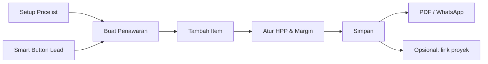
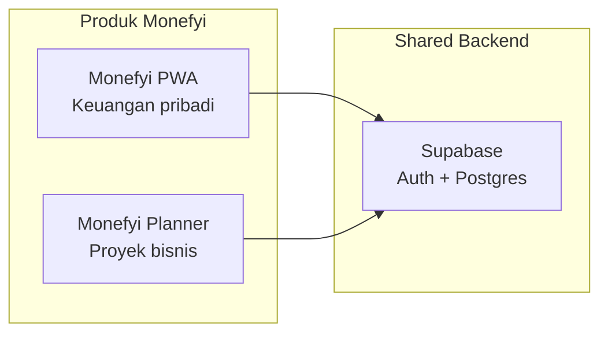
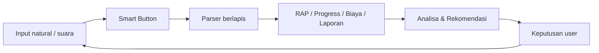

# Apa Itu Monefyi Planner?

> **Dokumen penjelasan produk** — untuk memperkenalkan Monefyi Planner secara lengkap namun ringkas.  
> Cocok ditunjukkan saat presentasi, onboarding tim, atau diskusi dengan stakeholder.  
> **Terakhir diperbarui:** Agustus 2026  
> **Dokumen teknis lebih dalam:** [`MONEFYI_PLANNER_MASTER.md`](MONEFYI_PLANNER_MASTER.md) · **Indeks:** [`README.md`](README.md)

> **Cakupan dokumen ini:** aplikasi manajemen proyek bisnis di [planner.monefyi.com](https://planner.monefyi.com).  
> Produk terpisah dari Monefyi PWA keuangan pribadi di [monefyi.com/app/](https://monefyi.com/app/).

---

## Definisi singkat

**Monefyi Planner** adalah aplikasi **manajemen proyek berbasis AI** untuk kontraktor dan bisnis jasa Indonesia. Aplikasi ini membantu tim **merencanakan budget (RAP)**, **melacak progress & biaya**, dan **mendapat rekomendasi** — semuanya lewat interaksi semudah mengirim chat.

| | |
|---|---|
| **Tagline** | *Kelola proyek semudah chat dengan asisten pribadi.* |
| **Posisi** | Asisten manajemen proyek cerdas untuk kontraktor & SME |
| **Akses** | [planner.monefyi.com](https://planner.monefyi.com) — bisa di-install seperti aplikasi mobile (PWA) |
| **Bahasa** | Indonesia (utama) |

---

## Untuk siapa?

Monefyi Planner ditujukan untuk:

- **Kontraktor & pemborong** skala kecil-menengah (rumah, ruko, interior)
- **Project manager freelance** yang mengelola beberapa klien sekaligus
- **Tim jasa** (kitchen set, renovasi, konstruksi ringan) yang butuh tracking biaya & progress
- **Owner bisnis** yang ingin satu tempat untuk proyek + keuangan bisnis

Contoh profil: kontraktor rumah dengan 3–5 proyek aktif, studio interior dengan template pekerjaan berulang, atau mandor yang biasa catat di Excel dan WhatsApp.

---

## Masalah yang diselesaikan

| Masalah umum | Solusi Monefyi Planner |
|--------------|------------------------|
| Budget proyek di Excel, sering tidak update | **RAP** (Rencana Anggaran Pelaksanaan) terstruktur per proyek |
| Progress dilaporkan lewat WA group, sulit audit | **Work items** + log harian + Gantt timeline |
| Biaya proyek bocor, tidak tahu variance | **Realisasi biaya** otomatis vs RAP + alert |
| Software PM terlalu rumit & mahal | **Mobile-first**, bahasa Indonesia, learning curve rendah |
| Catat biaya di lapangan repot | **Smart Button** — ketik *"catat semen 10 sak 65000"* |
| Keuangan bisnis terpisah dari proyek | **Finance V2** — neraca bisnis + bridge biaya proyek |
| Buat penawaran/quotation manual | **Estimator** — pricelist, margin otomatis, PDF 4 template, kirim WhatsApp |
| Quotation Excel/Word tidak konsisten | **Pricelist master** + kode EST otomatis + pipeline status penawaran |
| Tim tidak punya akses terpusat | **Multitenant org** — owner, manager, member dengan role |

---

## Cara kerja produk

### Level 1 — Asisten operasional (MVP)

```
Buat proyek + RAP + timeline
        ↓
Catat progress & biaya via Smart Button (chat/suara)
        ↓
App analisa otomatis → laporan + rekomendasi
```

User merasa punya **asisten pribadi**: tidak perlu setting kompleks, cukup berinteraksi dengan satu tombol untuk operasional harian.

### Level 2 — Asisten prediktif (visi)

App mempelajari pola proyek user → **auto-suggest** RAP, daftar material, timeline → user fokus eksekusi di lapangan.

---

## Filosofi produk

### 1. Asisten pribadi, bukan software PM enterprise

Planner dirancang agar terasa seperti **asisten**, bukan Microsoft Project. Fokus pada outcome: *"Apakah proyek on budget dan on schedule?"* — bukan pada fitur PM yang jarang dipakai kontraktor SME.

### 2. Satu tombol untuk semua

**Smart Button** (tombol ✦) adalah pintu masuk tunggal:

- Catat biaya material
- Update progress pekerjaan
- Cek sisa budget
- Buka laporan
- Tanya rekomendasi

Semua lewat bahasa natural: *"galian pondasi selesai 85 persen"*, *"bayar tukang 2 juta cash"*.

### 3. Jujur kepada user

Setiap tombol di aplikasi harus **berfungsi**, **jujur dilabeli**, atau **disembunyikan**. Fitur yang belum siap (misalnya HR/payroll penuh) ditandai mock — bukan dibuat-buat seolah sudah live.

### 4. Bahasa & konteks Indonesia

Istilah yang dipakai user sehari-hari: **RAP**, **tenaga kerja**, **Kurva S**, **galian**, **plester** — bukan jargon PM internasional yang asing.

---

## Navigasi aplikasi

### Setelah login (`/app`)

| Area | Fungsi |
|------|--------|
| **Dashboard (Beranda)** | KPI proyek, cashflow, rekomendasi AI |
| **Proyek** | Daftar proyek — tampilan list, kanban, timeline (Gantt), kalender |
| **Detail Proyek** | 6 tab: Overview, Keuangan, Progress, RAP, Analisa, Laporan |
| **Keuangan Bisnis** | Kas, hutang/piutang, laba rugi, aset, stok, laporan, budget |
| **Estimator** | Pricelist, builder penawaran, PDF, WhatsApp — lihat [§ Estimator](#estimator--modul-penawaran--quotation) |
| **Tim** | Undang member, approve join request, kelola role |
| **Database Master** | Master material, tenaga kerja, template pekerjaan (RPP) |
| **Smart Button (✦)** | Modal command — input teks/suara untuk semua aksi |
| **Pengaturan** | Profil, org, feature flags (developer), tema |

### Alur onboarding

| Role | Alur |
|------|------|
| **Owner** | Signup → verifikasi email → buat organisasi → wizard → dashboard |
| **Member** | Join via link undangan, kode, atau cari perusahaan → wizard → dashboard |

---

## Fitur inti (perspektif bisnis)

### RAP — Rencana Anggaran Pelaksanaan

**Outcome:** User tahu berapa budget material, tenaga kerja, dan overhead sebelum mulai kerja.

- Input manual, import Excel, atau generate dari **template pekerjaan** (Kitchen Set, dll.)
- **Wizard tenaga kerja** 3 langkah untuk hitung biaya TK
- Variance otomatis saat biaya aktual masuk

### Gantt & Work Breakdown

**Outcome:** User melihat timeline semua proyek dalam satu view, plus detail per proyek.

- Timeline organisasi (semua proyek)
- Mini-Gantt di tab Progress setiap proyek
- Progress tertimbang per pekerjaan → **Kurva S**

### Smart Button

**Outcome:** Catat apapun di lapangan tanpa buka form panjang.

Contoh perintah:

| Input | Hasil |
|-------|-------|
| `catat semen 10 sak 65000` | Biaya tercatat ke proyek aktif |
| `progress galian 85 persen` | Work item terupdate + log harian |
| `berapa sisa budget project rumah A` | Ringkasan budget vs actual |
| `rekomendasi untuk project X` | Analisa AI + saran tindakan |
| `lead Budi 0812 kitchen set 3 meter` | Draft estimasi/penawaran → buka Estimator |

### Keuangan Bisnis (Finance V2)

**Outcome:** Owner punya neraca bisnis yang sehat, terpisah tapi terhubung dengan biaya proyek.

- Double-entry accounting (kas, piutang, hutang, modal, laba)
- Bridge otomatis: biaya proyek → jurnal bisnis
- Diagnosa neraca tidak seimbang

### Estimator — Modul Penawaran & Quotation

**Outcome:** Tim sales/estimator bisa dari **lead** sampai **penawaran PDF siap kirim** tanpa Excel, Word, atau desain manual — dengan margin dan HPP terhitung otomatis.

Estimator adalah modul **penjualan & pricing** terintegrasi di Planner. Cocok untuk studio interior, kontraktor, dan bisnis jasa yang sering buat quotation ke klien sebelum proyek dimulai.

#### Halaman Estimator (`/app/estimator`)

| Halaman | URL | Fungsi |
|---------|-----|--------|
| **Daftar Estimasi** | `/app/estimator` | Pipeline penawaran: cari, filter status, duplikat, hapus |
| **Buat / Edit Penawaran** | `/app/estimator/new` · `/app/estimator/:id` | Builder quotation lengkap |
| **Pricelist** | `/app/estimator/pricelist` | Master harga material, upah, alat, jasa, borongan |
| **Pengaturan PDF** | `/app/estimator/settings` | Branding perusahaan, rekening bank, tanda tangan, template |

#### Apa yang bisa dilakukan (end-to-end)



**1. Susun master harga (Pricelist)**

- Kategori: material, upah, alat, jasa, borongan, dan lainnya
- Setiap item punya: nama, spesifikasi/merk, satuan, **HPP (base cost)**, **margin default**, harga jual
- HPP dan harga jual **sinkron dua arah** — ubah margin → harga jual terhitung; ubah harga jual → margin terhitung
- Import/export **CSV** untuk bulk setup (template tersedia)
- Tampilan **kartu** atau **tabel**; edit inline dari picker saat buat penawaran

**2. Buat penawaran (Quotation Builder)**

- Kode otomatis: `EST-{tahun}-{nomor}` (mis. `EST-2026-042`)
- Data klien: nama, kontak, catatan kebutuhan
- **Link opsional ke proyek** — nama proyek dipakai di judul/filename PDF
- Masa berlaku penawaran: 7–30 hari
- Tambah item dari:
  - **Manual** — ketik langsung di grid
  - **Pricelist** — pilih dari master harga (multi-select per kategori)
  - **Smart Button** — intent *Buat dari Lead* (nama + WhatsApp + kebutuhan)
  - **Smart Input** *(opsional, flag dev)* — parse teks natural: *"kitchen set 3 meter HPP 8 jt margin 25%"*
- Per item: qty, HPP, margin %, harga jual, diskon (% + nominal), baris bonus (tampil nol rupiah), include/exclude dari total
- **Product group** — beberapa baris spesifikasi share qty yang sama (mis. lemari + countertop satu paket)
- Level penawaran: overhead %, diskon header (% + Rp), **adjustment** bernama (nego, voucher, dll.), toggle **PPN 11%**
- Catatan + syarat & ketentuan
- Upload hingga **3 foto proyek** (dikompres otomatis) untuk dilampirkan di PDF
- Kustomisasi desain PDF per penawaran: template, warna, tampilkan/sembunyikan foto, bank, tanda tangan

**3. Review & export**

- **Preview PDF** di browser sebelum kirim
- **Download PDF** — filename: `Penawaran Project {nama}.pdf`
- **Share WhatsApp** — kirim teks terformat atau unduh PDF + deep link
- Panel ringkasan live: total HPP, overhead, diskon, PPN, grand total, **estimasi profit**

**4. Kelola pipeline penawaran**

- Status: `draft` → `sent` → `accepted` / `rejected` / `converted`
- Duplikat penawaran lama untuk revisi cepat
- Cari dan filter berdasarkan status

**5. Branding perusahaan**

- Logo, nama perusahaan, alamat, kontak
- Rekening bank untuk transfer
- Tanda tangan digital / cap
- **4 template PDF:** Modern, Classic, Minimal, Bold
- Warna brand default (sinkron dari pengaturan org)
- Template pesan WhatsApp kustom per org

#### Kekuatan bisnis

| Kekuatan | Manfaat untuk user |
|----------|-------------------|
| **Pricelist reusable** | Harga konsisten antar penawaran; tidak hitung ulang dari nol |
| **Margin-first pricing** | User fokus margin jual, bukan kalkulator Excel terpisah |
| **PDF profesional instan** | Penawaran siap kirim ke klien dalam hitungan menit |
| **Lead → penawaran 1 klik** | Smart Button capture lead langsung jadi draft quotation |
| **Pipeline terpusat** | Semua estimasi tercatat, bisa dilacak statusnya |
| **Bahasa & satuan Indonesia** | m², sak, btg, ls, format *85rb* / *3,5 jt* — familiar di lapangan |
| **Terbilang otomatis** | Nominal grand total ditulis huruf (contoh: *Sembilan puluh lima juta rupiah*) |

#### Kekuatan teknis

| Aspek | Implementasi |
|-------|--------------|
| **Mesin kalkulasi margin** | Engine gross-margin deterministik — harga jual + margin % sebagai anchor; HPP diturunkan; data legacy auto-sync |
| **PDF client-side** | **pdfmake** — generate PDF di browser, tanpa server render; 4 template branded |
| **Terbilang** | Library `terbilang-ts` untuk nominal Indonesia di PDF |
| **Model quotation kaya** | Diskon per item + header, bonus line, adjustment bernama, include/exclude, product group qty sync |
| **Gambar proyek** | Kompresi browser → upload Supabase Storage → signed URL embed di PDF |
| **Parser lokal estimator** | `estimatorParser.ts` — fuzzy match pricelist, alias satuan, shorthand rupiah |
| **Org-scoped data** | Pricelist, estimasi, PDF settings terisolasi per organisasi (RLS) |
| **Reuse lintas modul** | Format rupiah estimator dipakai juga laporan Finance V2 |

#### Integrasi dengan modul lain

| Modul | Hubungan |
|-------|----------|
| **Smart Button** | Intent `create_lead` → buat draft estimasi + 1 baris jasa → buka form edit; alternatif: buat proyek langsung |
| **Proyek** | Penawaran bisa di-link ke proyek existing; belum ada auto-convert estimasi → proyek + RAP |
| **RPP / Database Master** | Pricelist estimator **terpisah** dari master material RPP (RAP proyek); keduanya org-level data moat |
| **Finance V2** | Belum bridge otomatis estimasi accepted → invoice; potensi integrasi roadmap |

#### Contoh alur harian

| Persona | Alur |
|---------|------|
| **Owner studio interior** | Setup pricelist Kitchen Set → klien WA tanya harga → Smart Button *"lead Budi 0812… kitchen set 3m"* → refine margin → PDF → kirim WA |
| **Estimator kontraktor** | Import CSV harga material → buat EST-2026-001 → tambah 20 item dari pricelist → overhead 10% → preview PDF Classic → download |
| **PM freelance** | Duplikat penawaran bulan lalu → edit qty & diskon nego → link ke proyek baru → kirim ke klien |

#### Status & batasan (Agustus 2026)

| Fitur | Status |
|-------|--------|
| Pricelist CRUD + CSV import | ✅ Live |
| Quotation builder + kalkulasi | ✅ Live |
| PDF 4 template + preview/download | ✅ Live |
| WhatsApp share (teks + PDF) | ✅ Live |
| Smart Button create_lead → estimasi | ✅ Live |
| Foto proyek di PDF | ✅ Live |
| Smart Input natural language *(di form)* | ⚠️ Ada kode; flag dev OFF |
| Ubah status draft→sent→accepted di UI | ⚠️ Partial — enum ada, UI transisi terbatas |
| Convert estimasi → proyek + RAP | 🔶 Belum — status `converted` reserved |

Detail teknis implementasi: [`MONEFYI_PLANNER_MASTER.md` § Estimator](MONEFYI_PLANNER_MASTER.md)

### Tim & Organisasi

**Outcome:** Owner mengontrol siapa akses apa.

- Role: owner, admin, manager, member, viewer
- Undangan email, join by code, audit log

---

## Insight bisnis

### Positioning

Monefyi Planner **bukan** competitor Microsoft Project atau Primavera. Targetnya adalah user yang hari ini pakai **Excel + WhatsApp** — dan butuh upgrade tanpa learning curve enterprise.

**Wedge product:** Smart Button + RAP. Gesekan input rendah, data terstruktur dari hari pertama.

### Competitive advantage

| Keunggulan | Mengapa penting |
|------------|-----------------|
| Input bahasa natural | Kontraktor di lapangan tidak isi form 20 field |
| Domain-specific (RAP, TK, Kurva S) | Generic PM tools tidak paham konteks Indonesia |
| Proyek + keuangan bisnis + penawaran | Satu platform vs Excel + Word terpisah |
| Estimator PDF + margin engine | Quotation profesional tanpa Canva/Word manual |
| AI parsing berlapis | Cepat (rule) + akurat (AI fallback) |
| Multitenant SaaS | Satu org, banyak proyek & member |

### Model bisnis

- **SaaS multitenant** — organisasi subscribe (free / pro / enterprise)
- **Product terpisah** dari Monefyi PWA — entitlement `planner` terpisah dari `monefyi`
- **Cross-sell potensial:** owner bisnis yang pakai Planner → Monefyi Finance untuk keuangan pribadi

### Pasar target (ICP)

1. Kontraktor rumah/toko — 1–10 proyek/tahun
2. Interior/furniture — template pekerjaan berulang
3. PM freelance — multi-klien, butuh laporan profesional
4. Bisnis jasa (event, cleaning, maintenance) — tracking biaya per job

---

## Ekosistem Monefyi

Monefyi bukan satu aplikasi — Planner adalah **produk bisnis** dalam ekosistem:

```
monefyi.com/app/          → Keuangan PRIBADI (individu/keluarga)
planner.monefyi.com       → Manajemen PROYEK BISNIS (kontraktor/SME)
```

Keduanya share **backend Supabase** (auth, database) tapi **audience dan fitur berbeda**.



**Catatan:** Login di satu app tidak otomatis berarti akses ke app lain — masing-masing punya product entitlement.

---

## Loop interaksi produk



---

## Status produk (Agustus 2026)

Transparansi MVP — fitur yang sudah **live** vs masih **dalam pengembangan**:

| Fitur | Status |
|-------|--------|
| Login, onboarding multi-role | ✅ Live |
| Buat & kelola proyek | ✅ Live |
| Smart Button catat biaya | ✅ Live |
| Dashboard KPI | ✅ Live |
| Project Detail V2 (6 tab) | ⚠️ Rollout (feature flag) |
| Gantt timeline | ⚠️ Partial — save/load OK, UI evolving |
| RAP wizard & import | ⚠️ Partial |
| Finance V2 (neraca bisnis) | ⚠️ Live dengan subset fitur |
| Estimator / quotation (pricelist, PDF, WA) | ✅ Live — convert→proyek belum |
| HR / payroll / attendance | 🔶 Mock — dilabeli, backend belum lengkap |
| Voice input Smart Button | ⚠️ Partial |

**Prinsip:** fitur mock **tidak disembunyikan** — user dan stakeholder tahu apa yang sudah siap pakai.

---

## Roadmap ringkas

| Horizon | Fokus |
|---------|-------|
| **Sekarang** | GA Project Detail V2, Gantt CRUD lengkap, RAP in-app |
| **3 bulan** | Voice Smart Button, CPM visual, crash analysis UI |
| **6 bulan** | Level 2 AI — auto-suggest RAP & timeline dari histori |
| **12 bulan** | Subscription billing, integrasi deeper dengan Monefyi Finance |

Detail teknis roadmap: [`MONEFYI_PLANNER_MASTER.md` §21](MONEFYI_PLANNER_MASTER.md#21-roadmap--known-gaps)

---

## Mulai dari mana?

| Peran | Langkah |
|-------|---------|
| **Stakeholder / investor** | Baca dokumen ini → demo di [planner.monefyi.com](https://planner.monefyi.com) |
| **User / owner bisnis** | Signup owner → buat org → buat proyek pertama → coba Smart Button |
| **Developer** | [`MONEFYI_PLANNER_MASTER.md`](MONEFYI_PLANNER_MASTER.md) → [`monefyi_planner/README.md`](../monefyi_planner/README.md) |
| **QA / ops** | [`monefyi_planner/docs/ONBOARDING.md`](../monefyi_planner/docs/ONBOARDING.md) → smoke test checklist |

---

## Dokumen terkait

| Dokumen | Untuk siapa |
|---------|-------------|
| [`MONEFYI_PLANNER_MASTER.md`](MONEFYI_PLANNER_MASTER.md) | Developer, arsitek, AI/Cursor |
| [`APA_ITU_MONEFYI.md`](APA_ITU_MONEFYI.md) | Penjelasan produk PWA (keuangan pribadi) |
| [`MONEFYI_MASTER.md`](MONEFYI_MASTER.md) | Referensi ekosistem Monefyi |
| [`monefyi_planner/docs/`](../monefyi_planner/docs/) | Onboarding, RLS, migration, UX audit |

---

*Document Version: 1.1 · Agustus 2026 · Monefyi Product*
