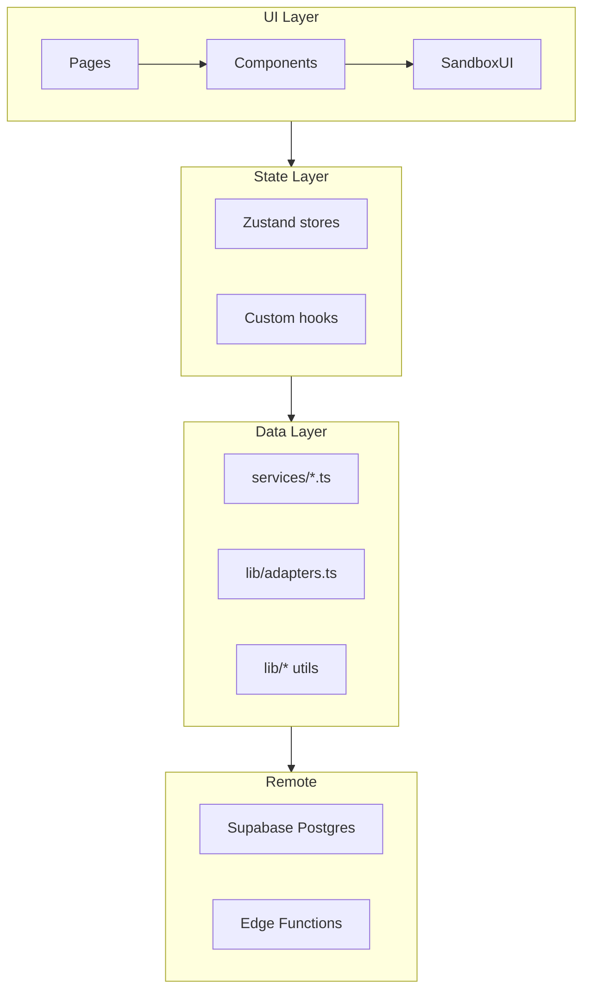
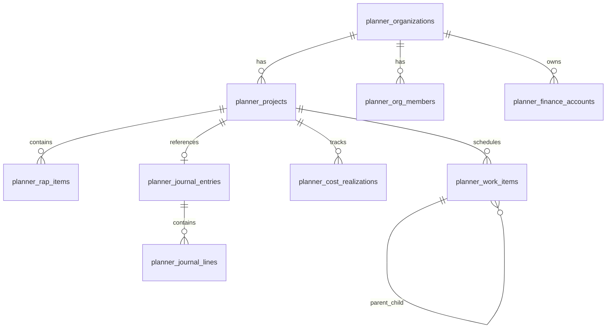

# Monefyi Planner — Dokumentasi Master

> **Dokumen referensi lengkap** produk Planner: filosofi, insight bisnis, arsitektur, data, fitur, algoritma, deploy, dan panduan pengembangan.  
> **Terakhir diperbarui:** Agustus 2026  
> **Indeks navigasi:** [`README.md`](README.md) · **Penjelasan stakeholder:** [`APA_ITU_PLANNER.md`](APA_ITU_PLANNER.md)

---

## Daftar isi

1. [Ringkasan eksekutif](#1-ringkasan-eksekutif)
2. [Filosofi & prinsip desain](#2-filosofi--prinsip-desain)
3. [Insight bisnis](#3-insight-bisnis)
4. [Ekosistem & produk entitlements](#4-ekosistem--produk-entitlements)
5. [Tech stack](#5-tech-stack)
6. [Arsitektur sistem](#6-arsitektur-sistem)
7. [Model data](#7-model-data)
8. [Modul & fitur — status implementasi](#8-modul--fitur--status-implementasi)
9. [Project Detail V2](#9-project-detail-v2)
10. [Gantt & work items](#10-gantt--work-items)
11. [Progress & analitik](#11-progress--analitik)
12. [Smart Button — Command Center](#12-smart-button--command-center)
13. [Algoritma bisnis](#13-algoritma-bisnis)
14. [Finance V2 / V3](#14-finance-v2--v3)
15. [Keamanan & multitenancy](#15-keamanan--multitenancy)
16. [Feature flags & migrasi](#16-feature-flags--migrasi)
17. [Edge Functions](#17-edge-functions)
18. [Struktur kode](#18-struktur-kode)
19. [Deploy & operasional](#19-deploy--operasional)
20. [Testing & QA](#20-testing--qa)
21. [Roadmap & known gaps](#21-roadmap--known-gaps)
22. [Indeks dokumen terkait](#22-indeks-dokumen-terkait)
23. [Glosarium](#23-glosarium)

---

## 1. Ringkasan eksekutif

**Monefyi Planner** adalah aplikasi **SaaS multitenant manajemen proyek** untuk kontraktor dan bisnis jasa Indonesia. Frontend kanonik: **React 19 SPA** di [`monefyi_planner/`](../monefyi_planner/), deploy di **https://planner.monefyi.com**.

| Aspek | Deskripsi |
|-------|-----------|
| **Janji produk** | *Kelola proyek semudah chat dengan asisten pribadi.* |
| **Target user** | Kontraktor SME, PM freelance, tim jasa dengan multi-proyek |
| **Platform** | PWA installable — React + Vite + Tailwind |
| **Backend** | Supabase shared dengan Monefyi Finance (`my-supabase-project/`) |
| **AI** | Gemini via Edge Function `planner-parse-command` (+ rule-based lokal) |
| **Deploy** | Vercel, root directory `monefyi_planner`, output `dist/` |

### Kekuatan inti

- **Smart Button** — satu entry point untuk catat biaya, update progress, navigasi, dan query
- **RAP** (Rencana Anggaran Pelaksanaan) — BOQ material & tenaga kerja terstruktur
- **Gantt / WBS** — timeline organisasi + mini-Gantt per proyek
- **Keuangan bisnis** — double-entry (Finance V2), neraca, hutang/piutang, opex
- **Estimator** — quotation & pricelist dengan PDF
- **Multitenant org** — owner/manager/member dengan RLS ketat

### Frontend kanonik vs legacy

| Frontend | Folder | Status |
|----------|--------|--------|
| **React (kanonik)** | [`monefyi_planner/`](../monefyi_planner/) | Aktif — `planner.monefyi.com` |
| **Vanilla PWA (legacy)** | [`planner/`](../planner/) | Alternatif/deploy terpisah, shared Supabase |

---

## 2. Filosofi & prinsip desain

### 2.1 Asisten pribadi, bukan PM software kompleks

Planner dirancang agar user merasa punya **asisten**, bukan mengoperasikan software enterprise. User cukup:

1. Buat planning (proyek + RAP + timeline)
2. Interaksi harian lewat **Smart Button** (teks/suara)
3. App yang menganalisa, melapor, dan merekomendasikan

**Level 1 (MVP aktif):** planning → Smart Button → analisa otomatis.  
**Level 2 (visi):** app belajar pola user → auto-suggest RAP, material, timeline.

### 2.2 Satu tombol untuk semua aksi

Smart Button (FAB / tab ✦) adalah **single entry point**. Semua intent — catat biaya, update progress, buka laporan — masuk lewat satu modal command, bukan menu tersembunyi.

### 2.3 Jangan tipu user

Prinsip UX dari audit Mei 2026 ([`UX_COMPLETION_PLAN.md`](../monefyi_planner/docs/UX_COMPLETION_PLAN.md)):

1. **Tombol harus jujur** — wire ke backend, disable + label, atau sembunyikan; jangan mock tanpa label
2. **Satu aksi = satu outcome** — klik punya feedback (loading, toast, navigasi, error)
3. **Deep link konsisten** — `/app/projects/:id` sinkron dengan modal/detail
4. **Scope MVP transparan** — fitur tanpa tabel DB (HR/payroll penuh) dilabeli mock

### 2.4 Indonesia-first & domain kontraktor

- UI default Bahasa Indonesia; istilah domain: RAP, tenaga kerja, Kurva S, galian, plester
- Parser command dioptimalkan untuk pola input kontraktor: *"catat semen 10 sak 65000"*
- Angka fleksibel: ribu, juta, format lokal

### 2.5 Parsing berlapis (deterministik → AI)

Pipeline command mengikuti arsitektur referensi ([`ARSITEKTUR_PARSING_MONEFYI.md`](ARSITEKTUR_PARSING_MONEFYI.md) §3.3):

```
Input user (teks/suara)
  → Preprocessor lokal (normalize, memory)
  → Rule-based parser (confidence ≥ 0.85 → execute)
  → AI fallback: planner-parse-command (Gemini)
  → Execute intent + log ke planner_command_logs
  → (Future) Self-improve: update parsing rules
```

Planner adalah **gold standard** pipeline ini; PWA Monefyi Finance sedang migrasi ke pola serupa.

---

## 3. Insight bisnis

### 3.1 Ideal Customer Profile (ICP)

| Segment | Pain point | Fit Planner |
|---------|------------|-------------|
| Kontraktor rumah/toko | Budget Excel + WA group | RAP + biaya real-time + laporan |
| Interior/furniture (Kitchen Set, dll.) | Template pekerjaan berulang | Job template + wizard create project |
| PM freelance multi-klien | Tidak punya tools PM formal | Multi-proyek, Gantt ringan, Smart Button |
| Owner bisnis jasa | Keuangan bisnis terpisah dari proyek | Finance V2 double-entry + bridge proyek |

### 3.2 Value proposition

| Level | Deskripsi |
|-------|-----------|
| **L1 — Asisten operasional** | User buat planning → catat progress & biaya via chat → dapat analisa & rekomendasi |
| **L2 — Asisten prediktif** | App belajar pola → suggest RAP, material, timeline → user fokus eksekusi |

### 3.3 Positioning kompetitif

| Alternatif user | Kelemahan | Keunggulan Planner |
|-----------------|-----------|-------------------|
| Excel + WhatsApp | Tidak terstruktur, sulit audit | RAP + work items + command log |
| PM enterprise (MS Project, Primavera) | Overkill, learning curve tinggi | Mobile-first, bahasa natural |
| Accounting software saja | Tidak track progress proyek | Integrasi proyek + keuangan bisnis |
| Generic todo apps | Tidak paham RAP/EVM | Domain-specific construction/SME |

**Wedge product:** Smart Button + RAP — gesekan input rendah, data terstruktur sejak hari pertama.

### 3.4 Monetisasi & growth hooks

- **Plan tiers** di `planner_organizations.plan_type`: `free`, `pro`, `enterprise`
- **Product entitlement** terpisah dari PWA: RPC `user_has_product('planner')`
- **Cross-sell potensial:** user Planner → Monefyi Finance PWA (keuangan pribadi owner)
- **Data moat:** parsing rules per org, job templates, RPP master (material/worker/pricelist)

---

## 4. Ekosistem & produk entitlements

### 4.1 Peta produk Monefyi

```
monefyi.com/app/          → PWA keuangan pribadi (vanilla JS)
planner.monefyi.com       → Planner React (SaaS bisnis/proyek) ★ dokumen ini
[deploy terpisah]         → planner/ vanilla (legacy)
```

Produk **terpisah, audience berbeda**, backend **Supabase shared**.

### 4.2 Shared Supabase strategy

Keuntungan instance bersama:

- **Shared Auth** — session Supabase valid across apps (potensi SSO)
- **Shared profiles** — `profiles.settings` untuk migration flags, finance version
- **Cross-app data** — biaya proyek bisa di-bridge ke ledger bisnis
- **Single billing** — satu Supabase project, satu Vercel org

Isolasi data:

- Prefix tabel: `planner_*`, `rpp_*`
- RLS per org via helper `planner_auth_*()`
- Product gate: `user_has_product('planner')` di bootstrap

### 4.3 Bootstrap & entitlement

File kunci: [`useBootstrap.ts`](../monefyi_planner/src/hooks/useBootstrap.ts), [`productEntitlements.ts`](../monefyi_planner/src/services/productEntitlements.ts)

Alur login:

1. Supabase Auth session
2. Load profile + cek `user_has_product('planner')`
3. Load org membership + projects
4. Redirect ke `/app` atau onboarding

---

## 5. Tech stack

| Layer | Teknologi | Versi (Agustus 2026) |
|-------|-----------|----------------------|
| **UI framework** | React | 19.2 |
| **Build** | Vite | 7.3 |
| **Routing** | react-router-dom | 7.x |
| **Styling** | Tailwind CSS | 4.1 |
| **State** | Zustand | 5.x |
| **Backend client** | @supabase/supabase-js | 2.49 |
| **Grid** | AG Grid Community | 35.x |
| **Charts** | Recharts | 3.x |
| **DnD** | @hello-pangea/dnd | 18.x |
| **PDF** | pdfmake | 0.3 |
| **Excel** | xlsx | 0.18 |
| **Animation** | Framer Motion | 12.x |
| **Icons** | Lucide React | 1.x |
| **Testing** | Vitest | 3.x |
| **Hosting** | Vercel | root `monefyi_planner` |
| **PWA** | Service Worker + manifest | [`src/lib/pwa.ts`](../monefyi_planner/src/lib/pwa.ts) |

**Node:** ≥ 20.x

---

## 6. Arsitektur sistem

### 6.1 High-level diagram

```
┌─────────────────────────────────────────────────────────┐
│              planner.monefyi.com (Vercel CDN)            │
│  React SPA · PWA · Service Worker · Web Speech API      │
│                                                         │
│  AppShell → Projects / Finance V2 / Estimator / HR      │
│           → CommandModal (Smart Button)                 │
└─────────────────────────┬───────────────────────────────┘
                          │ HTTPS (Supabase JS client)
                          ▼
┌─────────────────────────────────────────────────────────┐
│                   Supabase (shared)                      │
│  Auth · PostgreSQL + RLS · Realtime · Storage           │
│                                                         │
│  planner_* tables · rpp_* master · profiles             │
│  Edge Functions: planner-parse-command, planner-analyze │
└─────────────────────────────────────────────────────────┘
```

### 6.2 Layer aplikasi (React)



| Layer | Folder | Peran |
|-------|--------|-------|
| **Pages** | `src/pages/` | Route-level screens (Dashboard, Projects, Finance V2 routes) |
| **Components** | `src/components/` | UI modular (projects/v2, gantt, finance-v2, hr) |
| **Store** | `src/store/` | Zustand global state (`appStore`, `ganttStore`, `uiStore`) |
| **Services** | `src/services/` | Supabase CRUD + edge function calls (~77 files) |
| **Lib** | `src/lib/` | Adapters, parsers, migration mappers, gantt utils |
| **Types** | `src/types/` | TypeScript domain types |

### 6.3 Routing

File: [`src/router.tsx`](../monefyi_planner/src/router.tsx)

| Route | Screen |
|-------|--------|
| `/` | Landing |
| `/login`, `/signup`, `/signup/owner` | Auth |
| `/verify-email` | Email verification |
| `/join`, `/join-by-code`, `/find-company` | Member join |
| `/onboarding/owner`, `/onboarding/member` | Wizard onboarding |
| `/app/*` | App shell (protected) |
| `/admin` | Super admin |

App shell tabs (via `AppShell.tsx`): home, projects, finance, estimator, hr, team, database, settings.

---

## 7. Model data

Semua migrasi kanonik: [`my-supabase-project/supabase/migrations/`](../my-supabase-project/supabase/migrations/)

### 7.1 Entitas inti

#### Organisasi & anggota

| Tabel | Deskripsi |
|-------|-----------|
| `planner_organizations` | Tenant: name, slug, owner, plan_type, settings |
| `planner_org_members` | Membership: role (owner/admin/manager/member/viewer) |
| `planner_invitations` | Undangan email/token |
| `planner_join_requests` | Request join by domain/code |
| `planner_audit_logs` | Audit CRUD sensitif |

#### Proyek & perencanaan

| Tabel | Deskripsi |
|-------|-----------|
| `planner_projects` | Proyek: timeline, status, budget summary, finance_status |
| `planner_rap_categories` | Kategori RAP (material/labor/equipment/overhead) |
| `planner_rap_items` | Line item RAP: qty, unit, price, type |
| `planner_work_items` | WBS/Gantt: parent_id, planned dates, progress_pct, weight, dependencies |
| `planner_project_members` | Assignment user ↔ proyek |
| `planner_project_incomes` | Pendapatan proyek |

#### Realisasi & operasional

| Tabel | Deskripsi |
|-------|-----------|
| `planner_cost_realizations` | Biaya aktual vs RAP |
| `planner_daily_logs` | Log harian: cuaca, tenaga kerja, foto |
| `planner_command_logs` | Log Smart Button: intent, params, confidence, status |
| `planner_parsing_rules` | Rule parser per org (self-improve) |
| `planner_analysis_snapshots` | Snapshot EVM/analisa |

#### Finance V2 (double-entry)

| Tabel | Deskripsi |
|-------|-----------|
| `planner_finance_accounts` | Chart of accounts (kas, piutang, hutang, modal, laba) |
| `planner_journal_entries` | Header jurnal |
| `planner_journal_lines` | Baris debit/kredit |
| `planner_opex_categories` | Kategori operasional |
| `planner_opex_budgets` | Budget opex per periode |
| `planner_receivables` / `planner_payables` | Piutang/hutang |
| `planner_fixed_assets` | Aset tetap + amortisasi |

Migrasi: `20260609120000_planner_finance_v2.sql`

#### RPP Master (Database Master)

| Tabel | Deskripsi |
|-------|-----------|
| `rpp_materials` | Master material per org |
| `rpp_workers` | Master tenaga kerja + rate |
| `rpp_job_templates` | Template pekerjaan (Kitchen Set, dll.) |
| `rpp_vendors`, `rpp_tools`, `rpp_clients` | Metadata pendukung |

Flag: `database_master` — lihat §16.

#### Shared

| Tabel | Penggunaan Planner |
|-------|-------------------|
| `profiles` | User settings, migration_flags, finance_version |
| `planner_notifications` | Notifikasi in-app |

### 7.2 Adapter layer

File: [`src/lib/adapters.ts`](../monefyi_planner/src/lib/adapters.ts)

Mapper DB ↔ UI: `DbProject` → `Project`, `DbWorkItem`, `DbRapItem`, `DbCostRealization`, dll.

### 7.3 Relasi konseptual



---

## 8. Modul & fitur — status implementasi

Status per Agustus 2026 — reconcile UX audit + kode aktual.

| Modul | Status | Catatan |
|-------|--------|---------|
| Auth (email/password) | **Live** | Supabase Auth |
| Multi-role onboarding | **Live** | Owner/member flows + edge functions |
| Product entitlement | **Live** | `user_has_product('planner')` |
| Dashboard KPI | **Live** | Stats + cashflow chart |
| AI recommendations | **Partial** | `planner-analyze` edge function |
| Project CRUD | **Live** | Create, list, archive |
| Project views | **Live** | List, kanban, timeline (Gantt), calendar |
| Project Detail V2 (6 tab) | **Partial** | Flag `project_view_v2` (default true di dev) |
| Command Center V1 | **Deprecated** | Sunset T+90 setelah GA V2 |
| Smart Button `record_cost` | **Live** | Smoke test production |
| Smart Button batch cost | **Live** | Multi-item parsing |
| Smart Button progress/RAP | **Partial** | Intent ada; coverage bervariasi |
| Voice input | **Partial** | Web Speech API; Whisper fallback planned |
| RAP CRUD | **Partial** | Wizard + Excel import; beberapa flow V1 mock |
| Labor wizard (tenaga kerja) | **Live** | 3-step wizard — lihat doc terpisah |
| Gantt org timeline | **Partial** | Load/save work items; modal CRUD |
| Gantt mini (project tab) | **Partial** | Progress tab integration |
| Work item dependencies | **Partial** | Service + save; UI evolving |
| Progress metrics (SPI, S-curve) | **Live** | `progressMetrics.ts` + tests |
| Finance V1 (project tab) | **Partial** | Legacy tab; bridge ke V2 |
| Finance V2 double-entry | **Live/Partial** | Journal, kas, hutang/piutang |
| Finance neraca validator | **Partial** | Flag `finance_dashboard_v2` |
| Estimator / quotation | **Live/Partial** | Pricelist, PDF templates |
| Database Master (RPP) | **Partial** | Flag `database_master` |
| Create project smart wizard | **Partial** | Flag `create_project_smart` |
| HR / payroll / attendance | **Mock** | UI ada; backend tidak lengkap |
| Global todos | **Mock** | Should migrate ke work items |
| Super admin panel | **Partial** | `/admin` route |
| PWA install | **Live** | SW + install banner |
| Realtime notifications | **Live** | Supabase subscription |

---

## 9. Project Detail V2

File utama: [`ProjectDetailV2.tsx`](../monefyi_planner/src/components/projects/v2/ProjectDetailV2.tsx)

### 9.1 Enam tab

| Tab | Komponen | Fokus |
|-----|----------|-------|
| **Overview** | `TabV2Overview.tsx` | Ringkasan proyek, KPI, health |
| **Keuangan** | `TabV2Keuangan.tsx` | Neraca proyek, transaksi, close project |
| **Progress** | `TabV2Progress.tsx` | Work items, Gantt mini, Kurva S |
| **RAP** | `TabV2Rap.tsx` | BOQ material & tenaga kerja |
| **Analisa** | `TabV2Analisa.tsx` | EVM, variance, rekomendasi |
| **Laporan** | `TabV2Laporan.tsx` | Export laporan |

### 9.2 Data loading

- Services: `projectService`, `rapService`, `costService`, `workItemService`
- Mapper sandbox → production: [`planner-mapper.ts`](../monefyi_planner/src/lib/migration/planner-mapper.ts)
- Popup config: [`project-popup-config.ts`](../monefyi_planner/src/components/projects/v2/project-popup-config.ts)
- Balance sheet validation saat load finance data

### 9.3 Deep link

URL `/app/projects/:id` membuka detail proyek (modal atau full view) — harus sinkron buka/tutup (prinsip UX §2.3).

---

## 10. Gantt & work items

### 10.1 Org-wide Gantt

File: [`GanttPlannerView.tsx`](../monefyi_planner/src/components/projects/gantt/GanttPlannerView.tsx)

| Komponen | Peran |
|----------|-------|
| `useGanttData.ts` | Load semua work items org + dependencies |
| `useProjectGanttData.ts` | Scope per proyek (mini dashboard) |
| `ganttSaveService.ts` | Persist perubahan bar/dates/dependencies |
| `ganttDependencyService.ts` | CRUD dependency (FS/FF/SS/SF) |
| `ganttBarColorService.ts` | Warna bar per status/proyek |
| `GanttAddWorkItemModal.tsx` | Tambah/edit work item |
| `TaskListPanel.tsx` | Panel daftar task |
| `ganttStore.ts` | Draft state, unsaved changes |

### 10.2 Work item model

Service: [`workItemService.ts`](../monefyi_planner/src/services/workItemService.ts)

Field kunci:

- `project_id`, `parent_id` — hierarki WBS
- `planned_start`, `planned_end`, `actual_start`, `actual_end`
- `progress_pct`, `weight` — progress tertimbang
- `assigned_to` — worker/user assignment
- Dependencies via tabel relasi (service `ganttDependencyService`)

### 10.3 Save flow

1. User edit di Gantt UI → update `ganttStore` (draft)
2. Save → `ganttSaveService` batch upsert work items + dependencies
3. Realtime refresh via reload hooks

---

## 11. Progress & analitik

Implementasi: [`progressMetrics.ts`](../monefyi_planner/src/lib/progressMetrics.ts)

### 11.1 Fungsi utama

| Fungsi | Deskripsi |
|--------|-----------|
| `schedulePlanProgress(start, end)` | Progress rencana berdasarkan posisi hari ini (0–100%) |
| `weightedActualProgress(items)` | Rata-rata tertimbang `progress_pct` × `weight` |
| `computeProgressSummary(project, workItems)` | Plan vs actual, SPI, overdue, days left |
| `buildSCurveFromWorkItems(project, items)` | Kurva S kumulatif planned vs actual |

### 11.2 Metrik ProgressSummary

```typescript
type ProgressSummary = {
  plan: number;        // % rencana (timeline)
  actual: number;      // % aktual (weighted work items)
  deviation: number;   // actual - plan
  spi: number;         // Schedule Performance Index (actual/plan)
  completed: number;   // work items 100%
  total: number;
  inProgress: number;
  overdue: number;     // planned end lewat, progress < 100%
  daysLeft: number;
};
```

### 11.3 Tests

- [`progressMetrics.test.ts`](../monefyi_planner/src/lib/progressMetrics.test.ts)
- [`project-popup-config.test.ts`](../monefyi_planner/src/components/projects/v2/project-popup-config.test.ts)

---

## 12. Smart Button — Command Center

### 12.1 UI entry points

- FAB di mobile layout
- Tab ✦ di bottom nav
- [`CommandModal.tsx`](../monefyi_planner/src/components/CommandModal.tsx)

### 12.2 Pipeline eksekusi

```
User input
  → commandNormalize.ts (preprocess)
  → commandMemoryService.ts (context/memory)
  → Rule parser lokal (confidence check)
  → planner-parse-command (AI fallback, Gemini)
  → intentExecutor.ts (executeIntent)
  → Service layer (costService, workItemService, …)
  → commandService.logCommand()
```

### 12.3 Intent catalog

| Intent | Contoh input | Aksi |
|--------|-------------|------|
| `record_cost` | "beli semen 20 sak 62 ribu" | Insert `planner_cost_realizations` |
| `record_cost_batch` | Multi-item dalam satu perintah | Batch insert costs |
| `update_progress` | "galian pondasi selesai 85 persen" | Update work item + daily log |
| `add_worker_log` | "hari ini hadir 4 orang, cuaca cerah" | Insert daily log |
| `check_budget` | "berapa sisa budget project X" | Query & return summary |
| `check_progress` | "progress project X berapa" | Query progress |
| `open_project` | "buka project rumah A" | Navigate |
| `open_report` | "lihat laporan mingguan" | Navigate |
| `add_rap_item` | "tambah pasir 10 kubik 350 ribu" | Insert RAP item |
| `add_work_item` | "tambah plester dinding 5 hari" | Insert work item |
| `ask_recommendation` | "rekomendasi untuk project X" | Trigger `planner-analyze` |
| `create_lead` | Estimator lead capture | CRM flow |
| `general_query` | "kapan deadline project X" | Query info |
| `unknown` | Tidak terparse | User edit manual di form |

User dapat **koreksi** parsed result sebelum execute; correction data di-log untuk self-improve.

### 12.4 Logging & observability

Tabel `planner_command_logs`: raw_input, parsed_intent, confidence, execution_status, correction_data.

Service: [`commandService.ts`](../monefyi_planner/src/services/commandService.ts)

---

## 13. Algoritma bisnis

### 13.1 Earned Value Management (EVM)

Metode standar PMI untuk mengukur performa proyek:

```
PV (Planned Value)   = Budget × Planned % Complete
EV (Earned Value)    = Budget × Actual % Complete
AC (Actual Cost)     = Total biaya aktual

SV (Schedule Variance) = EV - PV     → positif = ahead of schedule
CV (Cost Variance)     = EV - AC     → positif = under budget
SPI                    = EV / PV     → >1 ahead, <1 behind
CPI                    = EV / AC     → >1 hemat, <1 boros
EAC                    = Budget / CPI
ETC                    = EAC - AC
VAC                    = Budget - EAC
```

**Implementasi aktual:** `progressMetrics.ts` (SPI sederhana); EVM penuh di tab Analisa + `planner-analyze` (partial).

### 13.2 Critical Path Method (CPM)

Algoritma planned (production spec):

1. Build dependency graph dari work items
2. Forward pass — earliest start/finish
3. Backward pass — latest start/finish
4. Calculate float → critical path = zero float items

**Status:** Spec + pseudocode ada; implementasi UI CPM **partial** — dependencies ada, visual critical path belum GA.

### 13.3 Crash analysis & resource optimization

Trade-off waktu vs biaya saat menambah tenaga kerja di jalur kritis. Model produktivitas dengan communication overhead (Brooks-like).

**Status:** Spec di analisa engine; **belum fully exposed** di UI production.

### 13.4 Budget anomaly detection

Deteksi varians biaya tidak wajar vs RAP baseline (threshold + trend).

**Status:** Partial via dashboard/analisa tab.

### 13.5 Kurva S (S-Curve)

Kumulatif planned vs actual progress over time — [`buildSCurveFromWorkItems()`](../monefyi_planner/src/lib/progressMetrics.ts).

Digunakan di tab Progress Project V2.

---

## 14. Finance V2 / V3

### 14.1 Konsep

Finance V2 adalah **ledger double-entry** tingkat organisasi, terpisah dari finance V1 per proyek.

| Aspek | V1 (legacy) | V2 (aktif) |
|-------|-------------|------------|
| Scope | Per project tab | Org-wide `/app/finance-v2/*` |
| Model | Simple income/expense | Chart of accounts + journal |
| Neraca | Basic | Aktiva/Pasiva validator |
| Bridge | — | Project costs → journal entries |

### 14.2 Routes Finance V2

File: [`FinanceV2Routes.tsx`](../monefyi_planner/src/pages/finance-v2/FinanceV2Routes.tsx)

Dashboard, kasbank, hutangpiutang, labarugi, operasional, aset, stok, laporan, perencanaan, budget.

### 14.3 Project ↔ Ledger bridge

- [`financeIntegrationService.ts`](../monefyi_planner/src/services/financeV2/financeIntegrationService.ts)
- [`projectJournalBridge.ts`](../monefyi_planner/src/services/financeV2/projectJournalBridge.ts)
- Cost/income proyek → `planner_journal_entries` dengan `reference_type`

### 14.4 Finance version

User setting: `profiles.settings.finance_version` → `v1` | `v2` | `v3`

Service: [`financeVersion.ts`](../monefyi_planner/src/services/financeVersion.ts)

### 14.5 Feature flag

`finance_dashboard_v2` — neraca validator + diagnosa imbalance.

---

## 15. Keamanan & multitenancy

### 15.1 Row Level Security (RLS)

Semua tabel `planner_*` dilindungi RLS. Audit: [`RLS_AUDIT.md`](../monefyi_planner/docs/RLS_AUDIT.md)

### 15.2 Helper functions (SECURITY DEFINER)

| Function | Purpose |
|----------|---------|
| `planner_auth_org_ids()` | Org aktif untuk user saat ini |
| `planner_auth_admin_org_ids()` | Org where owner/manager |
| `planner_auth_owner_org_ids()` | Org where owner |
| `planner_auth_project_ids()` | Proyek readable |
| `planner_auth_admin_project_ids()` | Proyek writable (owner/manager) |
| `planner_auth_project_org_id(uuid)` | Resolve org dari project_id |

**Aturan emas:** jangan subquery tabel B dari policy A jika B juga subquery A (recursion 42P17).

### 15.3 Role matrix

| Role | Projects | RAP | Costs | Org settings | Finance V2 |
|------|----------|-----|-------|--------------|------------|
| owner | CRUD | CRUD | CRUD | CRUD | CRUD |
| admin | CRUD | CRUD | CRUD | read/update | CRUD |
| manager | CRUD | CRUD | CRUD | read | CRUD |
| member | read/write assigned | read | create | read | read |
| viewer | read | read | read | read | read |

### 15.4 Smoke test RLS

```bash
./scripts/rls-smoke-test.sh
```

Jalankan setelah `db push` atau migrasi RLS baru.

---

## 16. Feature flags & migrasi

Flags disimpan di `profiles.settings.migration_flags`.

File: [`migrationFlags.ts`](../monefyi_planner/src/lib/migrationFlags.ts)

| Flag | Default (dev) | Fitur |
|------|---------------|-------|
| `project_view_v2` | `true` | Project Detail 6-tab |
| `database_master` | `true` | `/app/database` — CRUD `rpp_*` |
| `create_project_smart` | `true` | Wizard create + RAP draft |
| `finance_dashboard_v2` | `true` | Neraca validator + diagnosa |

### Rollout playbook

Lihat [`MIGRATION_ROLLOUT.md`](../monefyi_planner/docs/MIGRATION_ROLLOUT.md):

- **Alpha:** internal team, semua flag ON
- **Beta:** org kecil, subset flags
- **GA:** `project_view_v2` default ON; sunset Command Center V1 T+90

### Deprecated UI

Lihat [`DEPRECATED_UI.md`](../monefyi_planner/docs/DEPRECATED_UI.md):

- Command Center V1 (`command-center/*`)
- `ProjectScheduleGantt.tsx` → diganti Gantt V2
- Finance V1 components (partial)

### Sandbox source

Prototype asal: [`refined-project-planner-prompt/`](../monefyi_planner/refined-project-planner-prompt/) — referensi UI/UX, bukan production deploy.

---

## 17. Edge Functions

Semua di [`my-supabase-project/supabase/functions/`](../my-supabase-project/supabase/functions/)

| Function | Purpose |
|----------|---------|
| `planner-parse-command` | AI parser Smart Button (Gemini) |
| `planner-analyze` | EVM + rekomendasi dashboard |
| `planner-create-owner-org` | Bootstrap org saat owner signup |
| `planner-create-invitation` | Buat undangan member |
| `planner-send-invitation-email` | Kirim email undangan |
| `planner-accept-invitation` | Terima undangan token |
| `planner-validate-invitation` | Validasi token undangan |
| `planner-revoke-invitation` | Cabut undangan |
| `planner-submit-join-request` | Request join org |
| `planner-approve-join-request` | Approve join request |
| `planner-reject-join-request` | Reject join request |
| `planner-search-companies` | Cari org by name/domain |
| `planner-try-domain-join` | Auto-join by email domain |
| `planner-resolve-domain` | Resolve custom domain |
| `planner-verify-custom-domain` | Verifikasi DNS domain |
| `planner-direct-create-member` | Admin create member langsung |
| `planner-change-member-role` | Ubah role member |
| `planner-remove-member` | Hapus member dari org |
| `planner-transfer-ownership` | Transfer ownership org |
| `planner-finance-amortize` | Amortisasi aset tetap |

Config mapping: [`src/lib/config.ts`](../monefyi_planner/src/lib/config.ts)

Secret: `GEMINI_API_KEY` (edge functions AI).

---

## 18. Struktur kode

```
monefyi_planner/
├── README.md
├── docs/                    ← Dok operasional (onboarding, RLS, migration, UX)
├── public/                  ← PWA assets, SW
├── refined-project-planner-prompt/  ← Sandbox prototype (referensi)
└── src/
    ├── main.tsx             ← Entry + PWA registration
    ├── router.tsx           ← Public + auth routes
    ├── pages/               ← Dashboard, Projects, Finance V2, Estimator, HR, onboarding
    ├── components/
    │   ├── AppShell.tsx     ← Main app layout + tabs
    │   ├── CommandModal.tsx ← Smart Button
    │   ├── projects/
    │   │   ├── gantt/       ← Org Gantt timeline
    │   │   ├── v2/          ← Project Detail V2 tabs
    │   │   └── command-center/  ← DEPRECATED
    │   ├── finance-v2/      ← Ledger UI
    │   ├── estimator/       ← Quotation builder
    │   ├── hr/, team/, settings/
    │   └── sandbox-ui/      ← Shared widgets
    ├── services/            ← Supabase CRUD (~77 files)
    │   ├── projectService.ts
    │   ├── workItemService.ts
    │   ├── ganttSaveService.ts
    │   ├── costService.ts, rapService.ts
    │   ├── commandService.ts
    │   └── financeV2/       ← Journal, accounts, bridge
    ├── store/               ← Zustand (appStore, ganttStore, uiStore, …)
    ├── lib/
    │   ├── adapters.ts      ← DB ↔ UI mappers
    │   ├── progressMetrics.ts
    │   ├── migration/       ← Sandbox → production mappers
    │   ├── gantt/           ← Gantt utils, types, snapshot
    │   └── config.ts        ← Supabase + function names
    ├── types/               ← financeV2, rpp, labor, estimator, …
    └── hooks/               ← useBootstrap, useRapRealtime, …
```

---

## 19. Deploy & operasional

### 19.1 Vercel

| Setting | Value |
|---------|-------|
| Root Directory | `monefyi_planner` |
| Framework | Vite |
| Build | `npm run build` |
| Output | `dist` |
| Domain | `planner.monefyi.com` |

### 19.2 Environment variables

| Variable | Deskripsi |
|----------|-----------|
| `VITE_SUPABASE_URL` | Supabase project URL |
| `VITE_SUPABASE_ANON_KEY` | Anon key |
| `NEXT_PUBLIC_SUPABASE_*` | Alias dari integrasi Vercel ↔ Supabase |
| `SUPABASE_URL` / `SUPABASE_ANON_KEY` | Alias alternatif |
| `VITE_APP_ENV` | `development` / `production` |

**Tidak di frontend:** `SUPABASE_SERVICE_ROLE_KEY`, `POSTGRES_*`

### 19.3 Supabase Auth URLs

- Site URL: `https://planner.monefyi.com`
- Redirect: `https://planner.monefyi.com/**`, `http://localhost:5173/**`

### 19.4 Deploy backend

```bash
./scripts/deploy-planner-supabase.sh
./scripts/rls-smoke-test.sh
```

### 19.5 Smoke test produksi

1. Signup → org di `planner_organizations`
2. Login → `/app`, session persist
3. Buat proyek → muncul di list
4. Smart Button: `catat semen 10 sak 65000` → row di `planner_cost_realizations`
5. Dashboard KPI + Finance menampilkan biaya

Detail: [`monefyi_planner/README.md`](../monefyi_planner/README.md)

---

## 20. Testing & QA

### 20.1 Unit tests (Vitest)

```bash
cd monefyi_planner && npm run test
```

| File | Coverage |
|------|----------|
| `progressMetrics.test.ts` | SPI, weighted progress, S-curve |
| `project-popup-config.test.ts` | Popup config V2 |
| `laborCostCalculator.test.ts` | Kalkulasi tenaga kerja |

### 20.2 QA checklists

| Dokumen | Scope |
|---------|-------|
| [`ONBOARDING.md`](../monefyi_planner/docs/ONBOARDING.md) | Multi-role flows |
| [`MIGRATION_ROLLOUT.md`](../monefyi_planner/docs/MIGRATION_ROLLOUT.md) | Feature flag regression |
| [`UX_COMPLETION_PLAN.md`](../monefyi_planner/docs/UX_COMPLETION_PLAN.md) | UI honesty audit |

### 20.3 Monitoring

- **Sentry:** error rate per migration flag
- **Audit:** `planner_audit_logs` untuk CRUD `rpp_*`
- **Balance:** log `isBalanced=false` counts per org (non-PII)

---

## 21. Roadmap & known gaps

### 21.1 Fase vs status aktual

| Fase (spec) | Status | Gap |
|-------------|--------|-----|
| Phase 1 — Foundation | ✅ Done | React migration complete |
| Phase 2 — Smart Button v1 | ✅ Mostly done | Voice partial |
| Phase 3 — Analytics | ⚠️ Partial | CPM UI, crash analysis UI |
| Phase 4 — AI Parser | ⚠️ Partial | Self-improve rules, full voice |
| Phase 5 — Admin & multi-tenancy | ✅ Mostly done | Subscription billing partial |
| Phase 6 — Gantt advanced | ⚠️ Partial | Critical path visual, resource leveling |
| Phase 7 — Mobile polish | ⚠️ Ongoing | UX audit P1/P2 items |

### 21.2 Priority gaps (dari UX audit)

| Severity | Item |
|----------|------|
| **P0** | Demo auth buttons tanpa session (dev) |
| **P1** | Hapus proyek, beberapa RAP CRUD mock, footer legal |
| **P1** | HR/payroll mock harus dilabeli |
| **P2** | Landing marketing stats, mobile avatar menu |

### 21.3 Dokumentasi gaps (resolved by doc ini)

- ~~Tidak ada master doc Planner~~ → dokumen ini
- ~~Gantt/work items undocumented~~ → §10
- ~~Progress metrics undocumented~~ → §11
- Backend markdown di `my-supabase-project/` — masih minimal (edge functions di §17)

---

## 22. Indeks dokumen terkait

### Dokumen Planner (repo)

| Dokumen | Isi |
|---------|-----|
| [`APA_ITU_PLANNER.md`](APA_ITU_PLANNER.md) | Penjelasan stakeholder |
| [`MONEFYI_PLANNER_MASTER.md`](MONEFYI_PLANNER_MASTER.md) | Dokumen ini |
| [`../monefyi_planner/README.md`](../monefyi_planner/README.md) | Setup dev & deploy |
| [`../monefyi_planner/docs/README.md`](../monefyi_planner/docs/README.md) | Indeks docs operasional |

### Docs operasional (`monefyi_planner/docs/`)

| Dokumen | Isi |
|---------|-----|
| [`ONBOARDING.md`](../monefyi_planner/docs/ONBOARDING.md) | Multi-role signup, edge functions, QA |
| [`MIGRATION_ROLLOUT.md`](../monefyi_planner/docs/MIGRATION_ROLLOUT.md) | Feature flags rollout |
| [`RLS_AUDIT.md`](../monefyi_planner/docs/RLS_AUDIT.md) | RLS policies & helpers |
| [`UX_COMPLETION_PLAN.md`](../monefyi_planner/docs/UX_COMPLETION_PLAN.md) | UI audit P0–P2 |
| [`DEPRECATED_UI.md`](../monefyi_planner/docs/DEPRECATED_UI.md) | Legacy components |
| [`WIZARD_TENAGA_KERJA.md`](../monefyi_planner/docs/WIZARD_TENAGA_KERJA.md) | Labor wizard 3-step |

### Ekosistem Monefyi

| Dokumen | Isi |
|---------|-----|
| [`MONEFYI_MASTER.md`](MONEFYI_MASTER.md) | Master doc PWA (ekosistem) |
| [`APA_ITU_MONEFYI.md`](APA_ITU_MONEFYI.md) | Penjelasan PWA stakeholder |
| [`ARSITEKTUR_PARSING_MONEFYI.md`](ARSITEKTUR_PARSING_MONEFYI.md) | Parsing pipeline (Planner = referensi) |
| [`archive/PLANNER_PRODUCTION_PLAN_v1.md`](archive/PLANNER_PRODUCTION_PLAN_v1.md) | Spec produksi v1 (arsip) |

---

## 23. Glosarium

| Term | Arti |
|------|------|
| **RAP** | Rencana Anggaran Pelaksanaan — rencana budget pelaksanaan proyek |
| **RPP** | Rencana Pelaksanaan Proyek — master data material/worker/template |
| **WBS** | Work Breakdown Structure — hierarki pekerjaan |
| **Work Item** | Unit pekerjaan terjadwal di Gantt/WBS |
| **BOQ** | Bill of Quantities — daftar kuantitas pekerjaan/material |
| **EVM** | Earned Value Management — metode ukur performa proyek |
| **CPM** | Critical Path Method — analisa jalur kritis |
| **SPI** | Schedule Performance Index — indeks kinerja jadwal (EV/PV) |
| **CPI** | Cost Performance Index — indeks kinerja biaya (EV/AC) |
| **Kurva S** | S-Curve — grafik kumulatif planned vs actual progress |
| **Crash Analysis** | Analisa trade-off waktu vs biaya percepatan proyek |
| **Smart Button** | Entry point command center (teks/suara → intent) |
| **Finance V2** | Ledger double-entry tingkat organisasi |
| **Migration Flag** | Feature toggle di `profiles.settings.migration_flags` |

---

*Document Version: 1.0 · Agustus 2026 · Monefyi Engineering*
