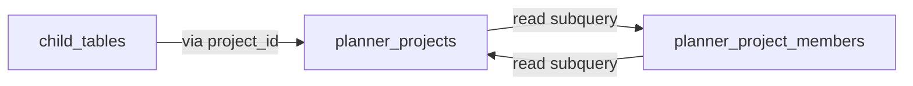

# RLS Policy Audit — Monefyi Planner

> Audit: 1 Juni 2026  
> Rule: **no cross-table subquery A→B if B→A exists.** Use `SECURITY DEFINER` helpers (see `20260531160200_*`, `20260601120000_*`).

## Helper functions (canonical)

| Function | Purpose |
|----------|---------|
| `planner_auth_org_ids()` | Active orgs for current user |
| `planner_auth_admin_org_ids()` | Orgs where user is owner/manager |
| `planner_auth_owner_org_ids()` | Orgs where user is owner |
| `planner_auth_project_ids()` | Projects readable by current user |
| `planner_auth_admin_project_ids()` | Projects writable by owner/manager |

All helpers: `STABLE`, `SECURITY DEFINER`, `SET search_path = public`, `SET row_security = off` (required when reading RLS-protected tables).

Additional helper: `planner_auth_project_org_id(uuid)` — resolves org for a project without recursive read policies (`20260601120200`).

## Dependency graph (before fix)

**Bug:** INSERT `planner_projects` + RETURNING → evaluates READ policy → 42P17 infinite recursion.

## Policy inventory

| Table | Policy | Subquery target | Risk | Fixed in |
|-------|--------|-----------------|------|----------|
| `planner_org_members` | read, manage | self (was) | High | `20260531160200` |
| `planner_organizations` | member_read | org_members | Medium | `20260531160200` |
| `planner_projects` | read/write/update/delete | org_members, **project_members** | **Critical** | `20260601120000`, `20260601120200` |
| `planner_project_members` | read, manage | **projects**, org_members | **Critical** | `20260601120000`, `20260601120200` |
| `planner_rap_items` | all | projects → org_members | High | `20260601120000` |
| `planner_work_items` | all | projects → org_members | High | `20260601120000` |
| `planner_cost_realizations` | all | projects → org_members | High | `20260601120000` |
| `planner_daily_logs` | all | projects → org_members | High | `20260601120000` |
| `planner_analysis_snapshots` | all | projects → org_members | High | `20260601120000` |
| `planner_invitations` | read | org_members inline | Medium | `20260601120000` |
| `planner_join_requests` | org_read, org_update | org_members inline | Medium | `20260601120000` |
| `planner_audit_logs` | owner | org_members inline | Medium | `20260601120000` |
| `planner_parsing_rules` | read | org_members inline | Low | `20260601120000` |
| `profiles` | self read/write | auth.uid only | Low | — |
| `planner_notifications` | own | user_id only | Low | — |
| `planner_command_logs` | own | user_id only | Low | — |
| `ai_usage`, `company_types`, `landing_content` | various | isolated | Low | — |

## Adding new RLS policies

1. Never subquery table B from A if B's policy subqueries A.
2. Add or reuse a `planner_auth_*()` SECURITY DEFINER helper.
3. Run `scripts/rls-smoke-test.sh` after `db push`.
