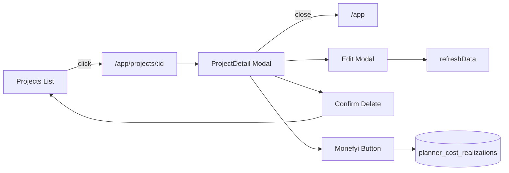
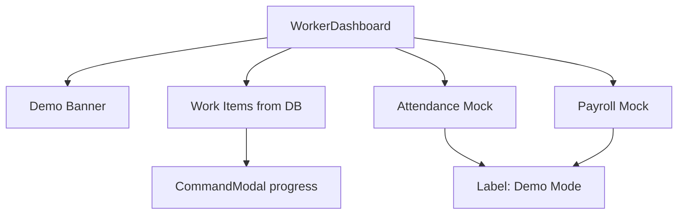

# Monefyi Planner — Audit UI & Rencana Penyempurnaan UX

> Audit tanggal: 31 Mei 2026  
> Scope: seluruh halaman & komponen shell (`src/pages/`, `src/components/`)  
> Tujuan: setiap kontrol interaktif harus **berfungsi**, **jujur** (bukan palsu), atau **disembunyikan** dengan jelas.

---

## Ringkasan eksekutif

| Kategori | Jumlah | Contoh |
|----------|--------|--------|
| **P0 — Bug / UX rusak** | 4 | Modal proyek tidak bisa ditutup permanen dari deep link |
| **P1 — Tombol/mock tanpa backend** | 38+ | Hapus proyek, Check Out worker, RAP CRUD in-app |
| **P2 — Polish / marketing** | 25+ | Footer legal, label bulan hardcoded |
| **Sudah berfungsi** | ~45 kontrol | Login, Smart Button core, notifikasi, buat proyek |

**Prinsip UX yang dipakai di rencana ini:**

1. **Jangan tipu user** — tombol yang tidak jalan → wire, disable + label, atau hide.
2. **Satu aksi = satu outcome** — klik harus punya feedback (loading, toast, navigasi, atau error).
3. **Deep link konsisten** — URL `/app/projects/:id` harus sinkron buka/tutup modal.
4. **Scope MVP** — fitur tanpa tabel DB (HR, payroll, global todos) tetap mock tapi **dilabeli** atau disederhanakan.

---

## Legenda severity

| Level | Arti | Target fix |
|-------|------|------------|
| **P0** | Broken — user stuck atau data hilang | Sprint 1 (1–2 hari) |
| **P1** | Terlihat produk tapi no-op / mock menyesatkan | Sprint 2–4 |
| **P2** | Polish, marketing, nice-to-have | Sprint 5+ |

---

## Inventori lengkap per halaman

### 1. Landing Page (`LandingPage.tsx`)

| # | Elemen | Perilaku sekarang | UX yang benar | Sev |
|---|--------|-------------------|---------------|-----|
| L1 | Nav Fitur / Cara Kerja / Harga | Scroll anchor | ✅ OK | — |
| L2 | Masuk / Mulai Gratis | → `/login`, `/signup` | ✅ OK | — |
| L3 | Hero stats (10x, 98%, …) | Statis marketing | Label “contoh” atau hapus angka spesifik | P2 |
| L4 | `DashboardPreview` | Mock Budi, revenue | OK untuk landing | P2 |
| L5 | Feature cards (6 tile) | `cursor-pointer`, tanpa aksi | Scroll ke section atau hapus pointer | P2 |
| L6 | Testimonials | Hardcoded | Disclaimer “contoh” | P2 |
| L7 | Pricing Enterprise CTA | → `/signup` | → `/contact` atau mailto | P2 |
| L8 | Footer Privacy / Terms / Contact | `href="#"` | Route `/privacy`, `/terms`, mailto | P1 |
| L9 | Props `onLogin` / `onSignup` | Tidak dipakai | Hapus dead props | P2 |

---

### 2. Auth (`AuthPages.tsx`)

| # | Elemen | Perilaku sekarang | UX yang benar | Sev |
|---|--------|-------------------|---------------|-----|
| A1 | Login email/password | Supabase + bootstrap | ✅ OK | — |
| A2 | Signup 3-step | Supabase signup | ✅ OK (partial) | — |
| A3 | Demo role buttons | Set store, **tanpa session** → bootstrap clear user | Mock session flag ATAU seed + skip auth clear | **P0** |
| A4 | Signup: business type / timezone | Tidak dikirim ke org | Persist ke `planner_organizations.settings` | P2 |
| A5 | Lupa password | Tidak ada di UI | Link → reset email flow | P2 |
| A6 | Google OAuth | Hidden (sesuai plan) | ✅ OK | — |

---

### 3. Shell (`Layout.tsx`, `AppShell.tsx`, `ProtectedRoute.tsx`)

| # | Elemen | Perilaku sekarang | UX yang benar | Sev |
|---|--------|-------------------|---------------|-----|
| S1 | Sidebar / bottom nav tabs | `setActiveTab` | ✅ OK | — |
| S2 | Monefyi Button (FAB / tab ✦) | Buka CommandModal | ✅ OK | — |
| S3 | Bell → NotificationPanel | Load + mark read DB | ✅ OK | — |
| S4 | Profil → Pengaturan | `setActiveTab('settings')` | ✅ OK | — |
| S5 | Keluar | `logout()` + navigate | Await logout + loading state | P2 |
| S6 | Mobile avatar header | **Tanpa onClick** | Buka menu profil sama desktop | P2 |
| S7 | Sync indicator | Kosmetik timeout | Tampilkan `refreshData` / error nyata | P2 |
| S8 | Header title `hr` / `admin` | Dead code (tab tidak ada) | Hapus branch | P2 |
| S9 | Deep link `/app/projects/:id` | Buka modal | ✅ OK | — |
| S10 | Tutup modal + URL `:id` masih ada | Modal **buka lagi** via `useEffect` | `navigate('/app')` on close | **P0** |
| S11 | Buka proyek dari list | Modal saja, URL tidak berubah | `navigate(/app/projects/:id)` | P2 |
| S12 | `selectedProjectId` dari list | Tidak di-set | Set saat buka modal (context Smart Button) | P2 |
| S13 | Worker routing | WorkerDashboard vs owner tabs | ✅ OK | — |

---

### 4. Dashboard (`Dashboard.tsx`)

| # | Elemen | Perilaku sekarang | UX yang benar | Sev |
|---|--------|-------------------|---------------|-----|
| D1 | KPI cards (4) | Data API `getProjectStats` | ✅ OK (read-only) | — |
| D2 | Label periode “Juni 2025” | Hardcoded | `toLocaleDateString` bulan aktif | P2 |
| D3 | Alert pill (at risk count) | Display only | Klik → Projects filter `at_risk` | P2 |
| D4 | Project cards | `onOpenProject` → navigate | ✅ OK | — |
| D5 | Cashflow chart | Satu series `amount` | Legend salah (Pemasukan+Keluar); fix ke “Pengeluaran 30 hari” | **P1** |
| D6 | Agenda / Log hari ini | Dari `recentLogs`, no click | Read-only OK; empty state lebih jelas | P2 |
| D7 | AI Recommendations expand | Chevron toggle, no detail | Tampilkan `action` / link proyek dari analyze | P2 |
| D8 | Aktivitas terbaru | Read-only logs | ✅ OK | — |

---

### 5. Projects — List (`Projects.tsx`)

| # | Elemen | Perilaku sekarang | UX yang benar | Sev |
|---|--------|-------------------|---------------|-----|
| P1 | Buat Proyek Baru | Buka modal → API create | ✅ OK | — |
| P2 | Search + filter chips | Client filter | ✅ OK | — |
| P3 | View card/list toggle | Local state | ✅ OK | — |
| P4 | **Filter Lanjut** | **No handler** | Modal filter (status, date, budget) ATAU hide | **P1** |
| P5 | Klik card/list row | Buka ProjectDetail | + sync URL (S11) | P2 |
| P6 | Avatar tim “AR, BS, RH +2” | Hardcoded | Hide atau load anggota (fase tim) | **P1** |
| P7 | Reset filter (empty) | Clear search/filter | ✅ OK | — |

---

### 6. Projects — Create Modal (`CreateProjectModal`)

| # | Elemen | Perilaku sekarang | UX yang benar | Sev |
|---|--------|-------------------|---------------|-----|
| C1 | Nama, tipe, lokasi, tanggal | Bound + create API | ✅ OK | — |
| C2 | **Kode proyek** | `defaultValue` uncontrolled | Read-only auto dari UUID / hide field | **P1** |
| C3 | **Estimasi budget** | Input **tidak bound** | `total_budget` ke `createProject` | **P1** |
| C4 | Nama klien | Field tidak ada di form | Tambah input `client_name` | P2 |
| C5 | Template RAP (step 3) | **No handler** | Seed `planner_rap_items` atau hide buttons | **P1** |
| C6 | Kembali / Lanjut / Buat | Step wizard | ✅ OK | — |

---

### 7. Projects — Detail Modal (`ProjectDetail`)

| # | Elemen | Perilaku sekarang | UX yang benar | Sev |
|---|--------|-------------------|---------------|-----|
| PD1 | Tab Overview / Planning / Realisasi / Laporan / Tim | Switch konten | ✅ OK | — |
| PD2 | X / backdrop close | `onClose()` | + clear URL (**S10**) | **P0** |
| PD3 | CPI / SPI | Computed dari project | ✅ OK | — |
| PD4 | CV / SV metrics | CV fake 5%; SV “-3 Hari” hardcoded | Hitung dari EVM atau hide | **P1** |
| PD5 | Kurva S | Dari work items / project % | ✅ OK (approximation) | — |
| PD6 | Aktivitas terbaru | Dari `daily_logs` | ✅ OK | — |
| PD7 | **AI Insights** (2 alert) | **Static text** | `analyzeProject(project.id)` | **P1** |
| PD8 | Planning → RAP | Load DB, read-only | + form tambah/edit/hapus RAP item | **P1** |
| PD9 | Planning → Schedule | Load work items | + CRUD work item | **P1** |
| PD10 | Realisasi → Catat Biaya/Log | Buka CommandModal | ✅ OK | — |
| PD11 | Tabel biaya ⋮ menu | **No handler** | Edit/delete + confirm dialog | **P1** |
| PD12 | Tab Tim | Placeholder “versi berikutnya” | Hide tab atau empty state konsisten | P1 |
| PD13 | Laporan chart RAP | `rapSummary` | ✅ OK | — |
| PD14 | OPI 1.03 / margin 32.5% | Hardcoded | Dari analyze / computed | **P1** |
| PD15 | EVM table PV/EV | Multiplier fixed 0.72/0.67 | Dari `planner-analyze` | **P1** |
| PD16 | Export PDF | `disabled` | Hide atau implement (out of MVP) | P1 |
| PD17 | Footer **Trash** | **No handler** | Confirm → `deleteProject` | **P1** |
| PD18 | Footer **Edit** | **No handler** | Inline edit / modal update | **P1** |
| PD19 | Footer **Arsip Proyek** | **No handler** | `status: cancelled/archived` | **P1** |
| PD20 | Footer **Update Status** | **No handler** | Dropdown status + save | **P1** |

---

### 8. Finance (`Finance.tsx`)

| # | Elemen | Perilaku sekarang | UX yang benar | Sev |
|---|--------|-------------------|---------------|-----|
| F1 | Catat via Monefyi Button | CommandModal | ✅ OK | — |
| F2 | Summary cards | Aggregate API | ✅ OK | — |
| F3 | Budget vs Realisasi rows | Read-only | Klik → buka project detail | P2 |
| F4 | Transaksi terbaru | Read-only costs | Klik → project; optional edit | P2 |

---

### 9. Settings (`Settings.tsx`)

| # | Elemen | Perilaku sekarang | UX yang benar | Sev |
|---|--------|-------------------|---------------|-----|
| ST1 | Edit nama + save | `updateProfileName` | ✅ OK | — |
| ST2 | Email | Read-only | OK untuk MVP | — |
| ST3 | Notice org/HR | Static | ✅ OK (scoped out) | — |
| ST4 | Keluar | logout + navigate | ✅ OK | — |

---

### 10. Worker Dashboard (`WorkerDashboard.tsx`)

| # | Elemen | Perilaku sekarang | UX yang benar | Sev |
|---|--------|-------------------|---------------|-----|
| W1 | Tab Home / Absensi / Gaji / Todo | Store `activeTab` | ✅ OK | — |
| W2 | CHECK IN | Local state only | GPS + API (future) atau label “Demo” | **P1** |
| W3 | **Check Out** | **No onClick** | Toggle checkout local + label demo | **P1** |
| W4 | Site / GPS text | Hardcoded “Rumah Pak Ahmad” | Dynamic dari assignment atau “Demo” | **P1** |
| W5 | Quick stats 23/26, 8 jam | Hardcoded | Hide atau “—” | **P1** |
| W6 | Todo list | Store `todos` **never loaded** | Load work items / daily tasks assigned | **P0** |
| W7 | Complete todo | `updateTodo` local only | Persist (needs todos table) | **P1** |
| W8 | Progress Task cards | Hardcoded 2 tasks | Load work items for worker | **P1** |
| W9 | **Update Progress** button | **No handler** | CommandModal prefill atau inline | **P1** |
| W10 | Attendance calendar | Hardcoded colors | Real attendance API | **P1** |
| W11 | Payroll / riwayat gaji | Hardcoded arrays | Mock + banner “Demo” | **P1** |
| W12 | **Ajukan Bon / Pinjaman** | **No handler** | Hide atau form stub + toast | **P1** |
| W13 | Todo chevron | No navigation | Detail atau hide | P2 |

---

### 11. Smart Button (`CommandModal.tsx`)

| # | Elemen | Perilaku sekarang | UX yang benar | Sev |
|---|--------|-------------------|---------------|-----|
| CB1 | Input + Enter / Send | parse → execute | ✅ OK | — |
| CB2 | Voice (id-ID) | Web Speech API | ✅ OK | — |
| CB3 | Quick commands (5) | Prefill + run | ✅ OK | — |
| CB4 | History rows | Fill input only | OK | P2 |
| CB5 | Intents supported | 8 intents wired | ✅ OK | — |
| CB6 | Intents di landing (check-in, assign) | Tidak di executor | Jangan promosikan di app | P2 |

---

### 12. Notifications (`NotificationPanel.tsx`)

| # | Elemen | Perilaku sekarang | UX yang benar | Sev |
|---|--------|-------------------|---------------|-----|
| N1 | Baca semua | DB + store | ✅ OK | — |
| N2 | Row click | Mark read + navigate | ✅ OK | — |
| N3 | Empty state | Message | ✅ OK | — |

---

## Matriks keputusan: Wire vs Hide vs Label Demo

| Fitur | Rekomendasi | Alasan |
|-------|-------------|--------|
| Project delete/edit/archive/status | **Wire** | API sudah ada (`projectService`) |
| RAP / work item CRUD | **Wire** | Services sudah ada, UI belum |
| Cost edit/delete | **Wire** | `costService.deleteCostRealization` ada |
| Worker attendance/payroll | **Label Demo** | Tidak ada tabel DB |
| Global todos | **Hide** atau pakai work items | Tidak ada `planner_todos` |
| PDF export | **Hide** | Out of MVP |
| Filter Lanjut | **Hide** sampai spec jelas | No-op menyesatkan |
| Team tab | **Hide** tab | Placeholder |
| Landing legal links | **Wire** minimal (static pages) | Dead link buruk untuk trust |

---

## Rencana implementasi (5 sprint)

### Sprint 1 — Bug fixes & navigasi (P0) · ~2 hari

**Goal:** Tidak ada user yang “terjebak” di UI.

| Task | File | Acceptance |
|------|------|------------|
| Fix deep link close loop | `Projects.tsx`, `AppShell.tsx` | Tutup modal → `navigate('/app')`; tidak reopen |
| Sync buka proyek dengan URL | `Projects.tsx` | Klik card → `/app/projects/:id` |
| Set `selectedProjectId` on open | `Projects.tsx`, store | Smart Button pakai proyek yang dibuka |
| Demo auth survival | `AuthPages.tsx`, `useBootstrap.ts` | Demo mode tidak di-clear oleh auth listener |
| Worker empty todos | `WorkerDashboard.tsx` | Empty state jelas; tidak tampil checkbox palsu |

**Smoke test Sprint 1:**
- [ ] Dashboard → proyek → tutup → URL `/app`
- [ ] Refresh di `/app/projects/:id` → modal terbuka
- [ ] Demo login (dev) tetap di `/app` setelah refresh

---

### Sprint 2 — Project lifecycle lengkap (P1) · ~3 hari

| Task | Acceptance |
|------|------------|
| CreateProject: bind budget + client | Budget tersimpan di `total_budget` |
| Hide kode proyek auto-generated | User tidak edit kode manual |
| ProjectDetail: delete dengan confirm | Row hilang dari DB + list |
| ProjectDetail: edit modal (name, dates, budget, client) | Update persist |
| ProjectDetail: archive / status dropdown | Status map ke DB |
| Cost row: delete (+ optional edit) | Biaya update di list + project spent |
| Hide Filter Lanjut & Export PDF | Tidak ada tombol mati |

---

### Sprint 3 — Planning & data nyata (P1) · ~4 hari

| Task | Acceptance |
|------|------------|
| RAP inline form (add/edit/delete) | CRUD `planner_rap_items` |
| Work item inline form | CRUD `planner_work_items` |
| ProjectDetail AI insights | Data dari `analyzeProject` |
| EVM / OPI dari analyze | Ganti hardcoded 1.03 / PV/EV |
| Dashboard cashflow legend fix | Label match data (pengeluaran) |
| Alert pill → filtered projects | Navigasi + filter aktif |

---

### Sprint 4 — Worker UX jujur (P1) · ~2 hari

**Constraint:** Tanpa schema baru — worker pakai work items + daily logs existing.

| Task | Acceptance |
|------|------------|
| Banner “Mode Demo” di worker pages | User tahu data mock |
| Progress tasks dari `workItems` assigned | Real data atau empty |
| Update Progress → CommandModal | Prefill “update progress …” |
| Check Out handler (local) | State toggle + timestamp |
| Hide / stub Ajukan Bon | Toast “Segera hadir” atau hide |
| Attendance calendar → simplified | “Belum tersedia” vs fake data |
| Remove hardcoded stats or show “—” | Tidak ada angka palsu |

---

### Sprint 5 — Polish & trust (P2) · ~2 hari

| Task | Acceptance |
|------|------------|
| Landing footer pages | `/privacy`, `/terms`, contact mailto |
| Forgot password flow | Email reset works |
| Signup org settings persist | business_type, timezone in org |
| Mobile avatar → profile menu | Same as desktop dropdown |
| Dashboard dynamic month label | Current month |
| AI recommendation actions | Expand shows suggested action |
| Finance row → open project | Navigate to detail |
| Logout loading / await | No flash wrong page |
| Remove dead header branches (hr/admin) | Clean code |

---

## Diagram alur UX target — Project Detail

---

## Diagram alur UX target — Worker (MVP jujur)

---

## Estimasi total

| Sprint | Fokus | Durasi | Kumulatif |
|--------|-------|--------|-----------|
| 1 | P0 bugs + navigasi | 2 hari | 2 hari |
| 2 | Project CRUD lengkap | 3 hari | 5 hari |
| 3 | RAP/work items + EVM nyata | 4 hari | 9 hari |
| 4 | Worker UX jujur | 2 hari | 11 hari |
| 5 | Polish & trust | 2 hari | **~2.5 minggu** |

---

## Checklist acceptance produksi (UX)

### Must pass sebelum launch
- [ ] Tidak ada tombol primary/secondary yang no-op tanpa label disabled
- [ ] Modal proyek buka/tutup konsisten dengan URL
- [ ] Create project menyimpan budget
- [ ] Delete project berfungsi
- [ ] Smart Button catat biaya → muncul di Finance & Project detail
- [ ] Worker page tidak menampilkan angka palsu tanpa label demo

### Should pass
- [ ] RAP & work item bisa ditambah dari UI
- [ ] AI insights project dari edge function
- [ ] Edit biaya / hapus biaya

### Nice to have
- [ ] Landing legal pages
- [ ] Forgot password
- [ ] PDF export

---

## Referensi file kunci

| Area | Files |
|------|-------|
| Routing / deep link | `AppShell.tsx`, `Projects.tsx`, `router.tsx` |
| Project API | `projectService.ts`, `rapService.ts`, `workItemService.ts`, `costService.ts` |
| Worker | `WorkerDashboard.tsx`, `workItemService.ts` |
| Smart Button | `CommandModal.tsx`, `intentExecutor.ts`, `commandParser.ts` |
| Auth demo | `AuthPages.tsx`, `useBootstrap.ts`, `config.ts` |

---

## Langkah berikutnya

1. Review & prioritaskan sprint dengan stakeholder (worker mock vs wire partial).  
2. Implement Sprint 1 (P0) terlebih dahulu — impact tinggi, effort rendah.  
3. Untuk setiap sprint: **hide** semua tombol yang belum di-wire di akhir sprint (jangan biarkan no-op).
